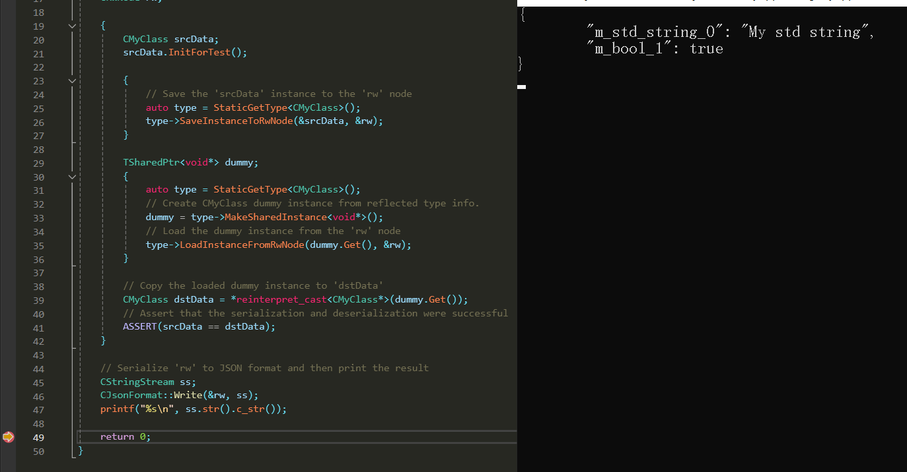
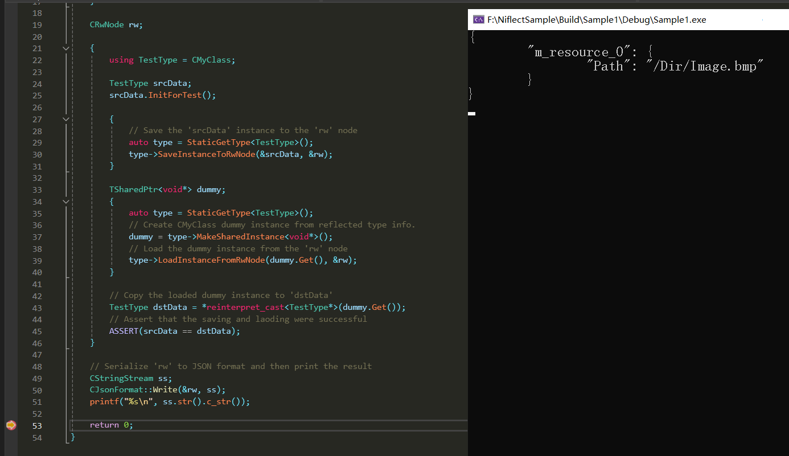

# Niflect

C++ 原生反射框架

**此概念现处于实验阶段**

为不浪费您的时间, 我希望在您开始阅读前, 确认自己具备足够的经验

- 能够理解为何有必要研究C++反射

以及这些要求之一

- 5年以上的C++使用经验
- 大型软件架构经验
- 编写代码量30万以上

如您符合以上要求, 请继续, 在此先感谢您所提任何建议.

## [实验 1] 反射代码生成工具

Niflect 中的反射代码生成工具称作 NiflectGenTool, 用法步骤如下 :

### 步骤 1

示例头文件

```C++
#pragma once
#include "MyClass_gen.h"

NIF_T()
class CMyClass
{
	GENERATED_BODY()
public:
	CMyClass()
		: m_bool_1(false)
	{
	}
	void InitForTest()
	{
		m_std_string_0 = "My std string";
		m_bool_1 = true;
	}
	bool operator==(const CMyClass& rhs) const
	{
		return m_std_string_0 == rhs.m_std_string_0
			&& m_bool_1 == rhs.m_bool_1
			;
	}

private:
	NIF_F()
	std::string m_std_string_0;
	NIF_F()
	bool m_bool_1;
};
```

如 `NIF_T` 的宏标签, 用于反射代码生成.

### 步骤 2

执行 NiflectGenTool 以生成反射代码, 下为 batch 脚本示例 :

```bash
@..\ThirdParty\NiflectGenTool\bin\NiflectGenTool.exe ^
-n MyApp ^
-h ../MyClass.h ^
-a ../ThirdParty/Niflect/include/Niflect/CommonlyUsed/DefaultAccessorSetting.h ^
-I ../ThirdParty/Niflect/include ^
-I ../ ^
-p NiflectGenerated 
```

生成反射代码如下图


关于命令行参数中的 **DefaultAccessorSetting.h**

此为 Niflect 的特性之一, 称作 Accessor Setting Header, 用于指定 C++ 原生风格的类型绑定

此头文件的简化版本如下

```C++
namespace DefaultAccessorSetting
{
	using namespace NiflectAccessorSetting;
	using namespace Niflect;

	NIF_AS_A() TSetting<CBoolAccessor, bool>;
	NIF_AS_A() TSetting<CSTLStringAccessor, std::string>;
}
```

该头文件可被代码补全工具解析.

当然地, 用户也可使用此方式绑定任意 `Accessor` 以实现自定义的序列化.

### 步骤 3

使用反射信息保存与载入示例类 `CMyClass` 的实例

```C++
#include "MyClass.h"
#include "MyApp/ModuleReg/MyApp_private.h"
#include "Niflect/NiflectTable.h"
#include "Niflect/Serialization/JsonFormat.h"

int main()
{
	using namespace Niflect;

	CNiflectTable table;

	{
		Niflect::GeneratedInitialReg(&table);
		table.InitTypesLayout();
	}

	CRwNode rw;

	{
		CMyClass srcData;
		srcData.InitForTest();
		
		{
			// Save the 'srcData' instance to the 'rw' node
			auto type = StaticGetType<CMyClass>();
			type->SaveInstanceToRwNode(&srcData, &rw);
		}

		TSharedPtr<void*> dummy;
		{
			auto type = StaticGetType<CMyClass>();
			// Create CMyClass dummy instance from reflected type info.
			dummy = type->MakeSharedInstance<void*>();
			// Load the dummy instance from the 'rw' node
			type->LoadInstanceFromRwNode(dummy.Get(), &rw);
		}
		
		// Copy the loaded dummy instance to 'dstData'
		CMyClass dstData = *reinterpret_cast<CMyClass*>(dummy.Get());
		// Assert that the saving and laoding were successful
		ASSERT(srcData == dstData);
	}

	// Serialize 'rw' to JSON format and then print the result
	CStringStream ss;
	CJsonFormat::Write(&rw, ss);
	printf("%s\n", ss.str().c_str());

	return 0;
}
```

运行结果



## [实验 2] C++ 原生风格

C++ 开发者可能经历过 :

- 为 C++ 或其它语言如 C# 的类型绑定, 修改代码生成工具.
- 解析字符串形式的数据获取 Type 或 Field 的 metadata.

当 C++ 反射框架并非完全的原生时, 这些工作可能就是必要的.

因此原生性, 是 C++ 开发者的强需求.

以下演示, 使用 Nfilect 能够实现何程度的原生性 :

```C++
namespace MyScope
{
	static CMyFieldMeta MyGetNata()
	{
		return CMyFieldMeta().SetFriendlyName("Being native is all that matters");
	}

	class CMyClassNata : public Niflect::CNata
	{
		typedef CMyClassNata CThis;
	public:
		CThis& SetCategory(const Niflect::CString& name)
		{
			m_categoryName = name;
			return *this;
		}
		Niflect::CString m_categoryName;
	};

	NIF_T(CMyClassNata().SetCategory("My Default Category"))
	class CEngineObject
	{
		GENERATED_BODY()
	public:
		NIF_F(CMyFieldMeta()
			.SetFriendlyName("This is a nata in multi lines"))
		float m_float_0;
		NIF_F(MyGetNata())
		Niflect::CString m_string_2;
		NIF_F()
		std::string m_std_string_3;
		NIF_F()
		std::vector<float> m_std_array_float_4;
		NIF_F()
		std::vector<std::vector<float> > m_std_array_array_float_5;
		NIF_F()
		std::vector<bool> m_std_bits_6;
		NIF_F()
		std::map<std::string, std::vector<float> > m_std_map_string_array_float_7;
	};
}
```

### Nata

Nata 是指以原生风格编写的, type/field 的 metadata, 如 `CMyClassNata`. Nata 能被代码补全工具所解析, 使开发者能够不需要熟悉相应框架所支持的功能的情况下, 方便地编写 metadata.

值得一提的是, 开发者甚至可封装 Nata 到另外的函数, 如 `MyGetNata()`.

### 嵌套模板与特化模板

嵌套模板如 `std::vector<float>`, 与特化模板如 `std::vector<bool>`, 可通过 Accessor Setting Header 绑定类型, 如下

```C++
using namespace NiflectAccessorSetting;

template <typename TInstance>
NIF_AS_A() TSetting<TSTLBitsArrayAccessor<TInstance>, std::vector<bool> >;

template <typename TInstance, typename T>
NIF_AS_A() TSetting<TSTLArrayAccessor<TInstance>, std::vector<T> >;

template <typename TInstance, typename T0, typename T1>
NIF_AS_A() TSetting<TSTLMapAccessor<TInstance>, std::map<T0, T1>, std::pair<T0, T1> >;
```

同样地, Accessor Setting Header 能使开发者绑定自定义的 `Accessor` 以实现自定义的序列化, 同时不需要修改如 NiflectGenTool 这样的反射代码生成工具.

更重要的是, 这种类型绑定的方式为真正的 C++ 原生风格.

## [实验 3] 序列化指针类型

现有 C++ 反射框架在处理指针时通常有限制, 如

- 完全不支持序列化指针
- 或仅支持特定类型的指针

这种限制是有理由的, 作为具通用性的框架, 一定无法获取足够的信息以创建或管理自定义类型的指针.

Niflect 使用者可通过编写 Accessor Setting 实现任意指针类型的序列化, 如 :

```C++
namespace SampleAccessorSetting
{
	NIF_AS_A() TSetting<CMyResourceAccessor, CMyResource*>;
}
```

此片段中 :

- `CMyResourceAccessor` 用于序列化类型为 `CMyResource` 的指针.
- `CMyResource` 为演示指针序列化的指针类型.

`CMyResourceAccessor`的实现 :

```C++
class CMyResourceAccessor : public Niflect::CAccessor
{
	using MyPtr = CMyResource*;
protected:
	virtual bool SaveInstanceImpl(const AddrType base, CRwNode* rw) const
	{
		const auto& instance = *static_cast<const MyPtr*>(base);
		AddRwString(rw, "Path", instance->m_path.c_str());
		return true;
	}
	virtual bool LoadInstanceImpl(AddrType base, const CRwNode* rw) const
	{
		auto& instance = *static_cast<MyPtr*>(base);
		auto path = FindRwString(rw, "Path");
		instance = g_factory.FindOrAddResource(path.c_str());
		return true;
	}
};
```

在此基础上, 带指针 Field 的示例类定义 :

```C++
class CMyResource
{
public:
	CMyResource(const std::string& path)
		: m_path(path)
	{
	}
	std::string m_path;
};

class CMyFactory
{
public:
	CMyResource* FindOrAddResource(const std::string& path)
	{
		auto ret = m_mapPathToResource.insert({ path, NULL });
		if (ret.second)
			ret.first->second = std::make_shared<CMyResource>(path);
		return ret.first->second.get();
	}

	std::map<std::string, std::shared_ptr<CMyResource> > m_mapPathToResource;
};

extern CMyFactory g_factory;

NIF_T()
class CMyClass
{
	GENERATED_BODY()
public:
	CMyClass()
		: m_resource_0(NULL)
	{
	}
	void InitForTest()
	{
		m_resource_0 = g_factory.FindOrAddResource("/Dir/Image.bmp");
	}
	bool operator==(const CMyClass& rhs) const
	{
		return m_resource_0 == rhs.m_resource_0
			;
	}

public:
	NIF_F()
	CMyResource* m_resource_0;
};
```

最后, Save 与 Load 类型 `CMyClass` 的实例, 方法同实验 1 中的步骤 3



## 以上实验代码

https://github.com/sainimu78/NiflectSample

## 总结

C++ 原生风格即是重点

### 特性

- 通过 Accessor Setting Header 进行 C++ 原生风格类型绑定
  - 无须修改代码生成工具即可实现自定义 type/field 序列化, 且方式极简.
- C++ 原生风格的 type/field metadata 指定方式
  - 开发者可通过 C++ 原生风格的方式编写 metadata
- 基于 libclang 的解析实现, 这意味着开发者可保持自己的编码规范
  - 如支持使用通过 `typedef` or `using` 定义的类型别名
  - 如支持使用 `namespace` 或嵌套的 `namespace`
- 真正意义的非入侵式反射实现
  - 可被反射的类型不要求从某个基类继承
  - 如宏标签 `NIF_T` 是空定义的宏, 而 `GENERATED_BODY` 仅定义`friend` 声明, 这些宏标签均无串入另外的 field 或 method 的定义. (如需对宏标签另外命名, 仅需要通过 `#define` 定义即可)
- 使用称作 `RwTree` 的一种可扩展的 C++ 原生序列化方式
  - 将数据保存到统一的属性结构 `CRwNode`, 再序列化为其它任意的数据格式.

### 关于名称 "Niflect"

由以下元素 :

- C++ `N`ative
- `N`on-`i`ntrusive 
- C++ Re`flect`ion

构成名称 "Niflect"