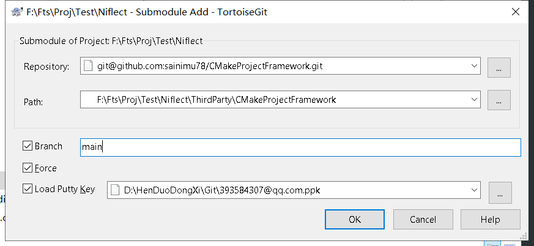

# 用乌龟添加 submodule



注意

- 避免繁琐切 submodule 的分支, 与无意义的状态不一致提示, 指定默认分支非常重要
- Force 也是必须的, 否则出错

或通过命令, 在执行该命令前需要提供 ppk 对应的 pem, 如(此为 Ubuntu 下的操作方法, 非 git 自带的 MinGW)

```
sudo apt install putty-tools
puttygen ~/.ssh/393584307@qq.com.ppk -O private-openssh -o ~/.ssh/ppk_on_ubuntu.pem
```

然后再

```
git submodule add -b main git@github.com:sainimu78/CMakeProjectFramework.git ThirdParty\CMakeProjectFramework
```

# 主 git checkout/pull 之后 clone 子模块

clone 后须 切到某个分支, 如切到主分支

```
git submodule update --init --recursive
git checkout main
```

# 删除 submodule

```
git rm --cached ThirdParty/CMakeProjectFramework
rm -rf ThirdParty/CMakeProjectFramework
```

手工清理 .gitmodules 中的配置, 已测试以下命令**无效**

```
git config -f .git/config --remove-section submodule.ThirdParty/CMakeProjectFramework
```

