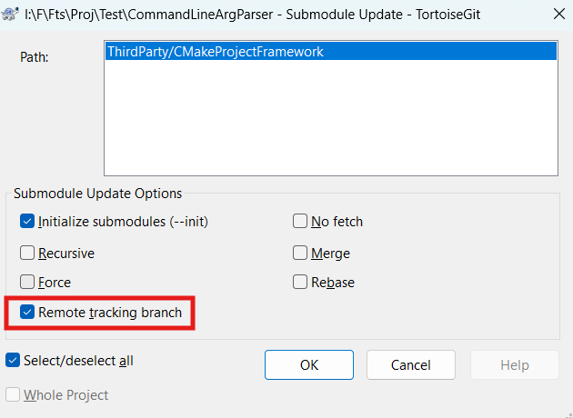

# 用乌龟添加 submodule


注意

- 避免繁琐切 submodule 的分支, 指定默认分支非常重要
- Force 也是必须的, 否则出错

或通过命令, 在执行该命令前需要提供 ppk 对应的 pem, 如(此为 Ubuntu 下的操作方法, 非 git 自带的 MinGW)

```
sudo apt install putty-tools
puttygen ~/.ssh/393584307@qq.com.ppk -O private-openssh -o ~/.ssh/ppk_on_ubuntu.pem
```

然后再

```
git submodule add -b main git@github.com:sainimu78/CMakeProjectFramework.git ThirdParty\CMakeProjectFramework
```

# 主 git checkout/pull 之后更新 submodule

(旧方法) clone 后须切到某个分支, 如切到主分支

```
git submodule update --init --recursive
git checkout main
```

上述操作非常繁琐, 由于已在添加 submodule 时指定分支, 因此如下操作即可方便更新 submodule 的代码

首先更新 submodule 配置

```
git submodule update --init --recursive
```

之后只需要通过此命令更新代码

```
git submodule update --remote
```



在更新 submodule 后, 主 git 将出现 submodule 所在目录被修改, 这是由于 submodule 的引用信息更新, 因此建议提交这种修改

```
git add -u
git commit -m "Update submodules"
git push
```

# 删除 submodule

```
git rm --cached ThirdParty/CMakeProjectFramework
rm -rf ThirdParty/CMakeProjectFramework
```

手工清理 .gitmodules 中的配置, 已测试以下命令**无效**

```
git config -f .git/config --remove-section submodule.ThirdParty/CMakeProjectFramework
```

